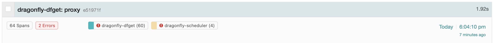
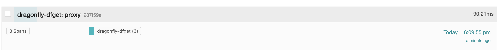
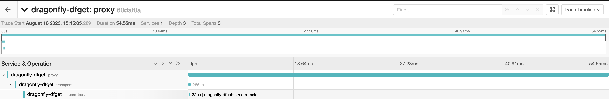
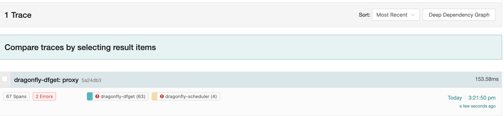

# Dragonfly

## Introduction

Dragonfly is a Kubernetes-native Peer-to-Peer (P2P) content delivery system. It allows optimization of container images within kubernetes clusters which reduces the load on external repos and enhances deployment efficiency. In the end, we increase the reliability of the pull operation and reduce network congestion.

## QuickStart

### Requirements:
- helm
- kind
- kubectl
- Make sure no corporate software signs certificates in your behalf when accessing registries. (zscaler/Anyconnect...)

### Steps

1. Stage a [Kind](https://kind.sigs.k8s.io/docs/user/quick-start/) cluster yaml with 2 workers

``` bash
## creates kind config, a cluster and changes context
POCD7Y=poc-dragonfly # name cluster to desired value
cat > kind-config.yaml << EOF ; kind create cluster --name $POCD7Y --config kind-config.yaml ; kubectl config use-context kind-$POCD7Y
kind: Cluster
apiVersion: kind.x-k8s.io/v1alpha4
nodes:
  - role: control-plane
  - role: worker
  - role: worker
EOF

```
connecting to kind cluster - if your terminal dies, or exits, you can configure your kube-config with the below
``` 
kind get kubeconfig --name $POCD7Y > kind-kubeconfig.yaml ; export KUBECONFIG=./kind-kubeconfig.yaml

```

2. Pull dragonfly images and loads them in the kind cluster
``` bash 
docker pull dragonflyoss/scheduler:latest
docker pull dragonflyoss/manager:latest
docker pull dragonflyoss/dfdaemon:latest
kind load docker-image dragonflyoss/scheduler:latest --name $POCD7Y
kind load docker-image dragonflyoss/manager:latest --name $POCD7Y
kind load docker-image dragonflyoss/dfdaemon:latest --name $POCD7Y

```

3. Create Dragonfly cluster based of helm charts, and install cluster. You should see the pods in the ```dragonfly-system```  ns if successful

```  bash 
cat > kind-config-chart.yaml << EOF ; helm repo add dragonfly https://dragonflyoss.github.io/helm-charts/ ; helm install --wait --create-namespace --namespace dragonfly-system dragonfly dragonfly/dragonfly -f kind-config-chart.yaml && kubectl get po -n dragonfly-system
containerRuntime:
  containerd:
    enable: true
    injectConfigPath: true
    registries:
      - 'https://ghcr.io'

scheduler:
  replicas: 1
  metrics:
    enable: true
  config:
    verbose: true
    pprofPort: 18066

seedPeer:
  replicas: 1
  metrics:
    enable: true
  config:
    verbose: true
    pprofPort: 18066

dfdaemon:
  metrics:
    enable: true
  config:
    verbose: true
    pprofPort: 18066

manager:
  replicas: 1
  metrics:
    enable: true
  config:
    verbose: true
    pprofPort: 18066

jaeger:
  enable: true
EOF

```
Cleanup

``` bash 
kind delete cluster --name $POCD7Y ; rm kind-config-chart.yaml  kind-config.yaml kind-kubeconfig.yaml

```
Dragonfly is set up at this point.

### Testing

####   Containerd will pull the image to the source for the first time:

1. Pull image in node 1 ``` docker exec -i $POCD7Y-worker /usr/local/bin/crictl pull ghcr.io/dragonflyoss/dragonfly2/scheduler:v2.0.5 ```
2. Next, we will use Jaegger exposing its service ```kubectl --namespace dragonfly-system port-forward service/dragonfly-jaeger-query 16686:16686```
3. In Jaegger's [UI]( http://127.0.0.1:16686/search) search for the trace created by the tag of the previously downloaded image:  ```http.url="/v2/dragonflyoss/dragonfly2/scheduler/blobs/sha256:8a9fba45626f402c12bafaadb718690187cae6e5d56296a8fe7d7c4ce19038f7?ns=ghcr.io":```

It took almost 2s for the pull operation!

#### Testing the local peer cached image
1. We delete the image from the worker node ```docker exec -i $POCD7Y-worker /usr/local/bin/crictl rmi ghcr.io/dragonflyoss/dragonfly2/scheduler:v2.0.5```
2. Pull the image again ```docker exec -i $POCD7Y-worker /usr/local/bin/crictl pull ghcr.io/dragonflyoss/dragonfly2/scheduler:v2.0.5```
3. Back in Jaegger's ui - we search for the same TAG:

It took 90ms! 

#### Containerd pulling image from a cached peer - node downloading image from another node
1. Pull image from 2nd worker node: ```docker exec -i $POCD7Y-worker2 /usr/local/bin/crictl pull ghcr.io/dragonflyoss/dragonfly2/scheduler:v2.0.5``` 
2. Access jaeger port ```16686``` with ```kubectl --namespace dragonfly-system port-forward service/dragonfly-jaeger-query 16686:16686```
3. in [Jaeger](http://127.0.0.1:16686/search) page search for the tracing with the test image tag: 
4. 
The image took 54ms from the node2. It pulled from the cached node.

#### Preheating image
1. We expose the Deagonfly manager port  ```kubectl --namespace dragonfly-system port-forward service/dragonfly-manager 8080:80```
2. Preheat the image
  
 ``` 
 curl --location --request POST 'http://127.0.0.1:8080/api/v1/jobs' \
--header 'Content-Type: application/json' \
--data-raw '{
    "type": "preheat",
    "args": {
        "type": "image",
        "url": "https://ghcr.io/v2/dragonflyoss/dragonfly2/manager/manifests/v2.0.5"
    }
}'

``` 
3. Polling the preheating status reveals it was successful ```curl --request GET 'http://127.0.0.1:8080/api/v1/jobs/1'``` search for "success" in the return payload.
4. We can pull the image from the worker ```Docker exec -i $POCD7Y-worker /usr/local/bin/crictl pull ghcr.io/dragonflyoss/dragonfly2/manager:v2.0.5```
5. Verify in Jaeger the pull metrics
 The node took 153ms to load the image from the preheat cache.


#### 

### References
- [Website](https://d7y.io/docs/)
- [Architecture](https://d7y.io/docs/concepts/terminology/architecture/)

### Glosary
**Preheat:** Process of proactively downloading and caching container images onto nodes within a Kubernetes cluster before they are actually needed for running pods or applications. This anticipatory approach ensures that the required images are readily available on nodes, reducing the latency and time required for pods to start.

